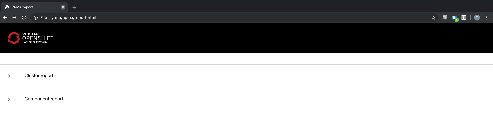

# 3.0 Control Plane Migration Assistance (CPMA)

Control Plane Migration Assistant ([CPMA](https://github.com/fusor/cpma)) is a Command Line interface to help as much as possible users migrating an OpenShift 3.7+ control plane configuration to an OpenShift 4.x. The utility provides Custom Resource (CR) manifests and reports informing users which aspects of configuration can and cannot be migrated.

## 3.1 Background

OpenShift Container Platform (OCP) version 3 uses Ansible's openshift-ansible modules to allow for extensive configuration.

Meanwhile OCP 4.x uses openshift-installer which integrates with supported clouds for deployment, openshift-installer is a Day-1 operation and relies on [Operators](https://www.openshift.com/learn/topics/operators) to install and configure the cluster.

Many of the installation options available during install time in OpenShift 3 are configurable by the user as Day-2 operations in OpenShift 4.
In many cases this is done by writing CRs for operators which affect the configuration changes.

Since there is no direct upgrade path from OCP 3 to OCP 4, the goal of CPMA is to ease the transition between the 2 OCP versions involved.

## 3.2 Goals

Bring the target Cluster to be as close as possible from the source cluster with the use of CR Manifests and report which configuration aspects can and cannot be migrated.
The tool effectively provides confidence information about each processed options to explain what is supported, fully, partially or not.
The generated CR Manifests can be applied to an OpenShift 4 cluster as Day-2 operations.

## 3.3 Non-Goals

Applying the CRs to the OpenShift 4 cluster directly is currently not an intended feature for this utility.
The user must review the output CRs and filter the desired ones to be applied to a targeted OCP 4 cluster.
Migrating workloads are not to be done with CPMA, please use the appropriate migration tool for this purpose.

## 3.4 Operation Overview

The purpose of the CPMA tool is to assist an administrator to migrate the control plane of an OpenShift cluster from version 3.7+ to its next major OpenShift version 4.x.
For that purpose CPMA sources information from:
- Cluster Configuration files:
  - Master Node:
    - Master configuration file - Usually /etc/origin/master/master-config.yaml
    - CRIO configuration file - Usually /etc/crio/crio.conf
    - ETC configuration file - Usually /etc/etcd/etcd.conf
    - Image Registries file - Usually /etc/containers/registries.conf
    - Dependent configuration files:
      - Password files
        - HTPasswd, etc.
      - Configmaps
      - Secrets
- APIs
  - Kubernetes
  - Openshift

Configuration files are processed to generate equivalent Custom Resource manifest files which can then to be consumed by OCP 4.x Operators.
During that process, every parameter that is analyzed is ported when compatible to its equivalent.
A feature fully supported or not means there is a direct or not equivalent in OCP 4.
A partially supported parameter indicates the feature is note entirely equivalent.
The reason for the latter is because some features are deprecated or used differently in OCP 4.
OCP 3 and 4 approach configuration management completely differently across.
Therefore it’s expected the tool cannot port all features across.

For more information about CPMA coverage please see [docs](./docs).

CPMA uses an ETL pattern to process the configuration files and query APIs which produce the output in two different forms:
- Custom Resource Manifest files in YAML format
- A report file (by default report.json) is produced by the reporting process

The user can then review the new configuration from the generated manifests and must also use the reports as a guide how to leverage the CRs to apply configuration to a newly installed OpenShift 4 cluster. The reviewed configuration can then be used to update a targeted OpenShift cluster.

Let's go ahead a run CPMA against our source 3.11 cluster to generate a report.  CPMA has already been installed on the bastion host.

1. SSH into bastion Host.
```bash
$ ssh lab-user@bastion.GUID.DOMAIN
```

2. Let's look at the help page for CPMA
```bash
$ ./cpma -h
```

```bash
Helps migration cluster configuration of a OCP 3.x cluster to OCP 4.x

Usage:
  cpma [flags]

Flags:
  -i, --allow-insecure-host        allow insecure ssh host key
  -c, --cluster-name string        OCP3 cluster kubeconfig name
      --config string              config file (Default searches ./cpma.yaml, $HOME/cpma.yml)
      --config-source string       source for OCP3 config files, accepted values: remote or local
      --crio-config string         path to crio config file
  -d, --debug                      show debug ouput
      --etcd-config string         path to etcd config file
  -h, --help                       help for cpma
  -n, --hostname string            OCP3 cluster hostname
  -m, --manifests                  Generate manifests (default true)
      --master-config string       path to master config file
      --node-config string         path to node config file
      --registries-config string   path to registries config file
  -r, --reporting                  Generate reporting  (default true)
  -k, --ssh-keyfile string         OCP3 ssh keyfile path
  -l, --ssh-login string           OCP3 ssh login
  -p, --ssh-port int16             OCP3 ssh port
  -v, --verbose                    verbose output
  -w, --work-dir string            set application data working directory (Default ".")
```

3. Authenticate against the OpenShift 3.11 Cluster
```bash
oc login https://master1.<GUID>.<DOMAIN>
```

4. Run CPMA and provide answers to the prompts, as follows:
```bash
$ ./cpma --manifests=false
```

eg:

```
$ ./cpma --manifests=false
? Do you wish to save configuration for future use? true
? What will be the source for OCP3 config files? Remote host
? Path to crio config file /etc/crio/crio.conf
? Path to etcd config file /etc/etcd/etcd.conf
? Path to master config file /etc/origin/master/master-config.yaml
? Path to node config file /etc/origin/node/node-config.yaml
? Path to registries config file /etc/containers/registries.conf
? Do wish to find source cluster using KUBECONFIG or prompt it? KUBECONFIG
? Select cluster obtained from KUBECONFIG contexts master1-ec26-events-opentlc-com:443
? Select master node master1.ec26.internal
? SSH login ec2-user
? SSH Port 22
? Path to private SSH key /home/lab-user/.ssh/openshift_key
? Path to application data, skip to use current directory .
WARN[19 Aug 19 20:21 UTC] Skipping Crio - Process exited with status 1
```

5. Checking our home directory (/home/lab-user), we can see that cpma has created several files:

```bash
$ ls -l /home/lab-user
```

```
$ ls -l /home/lab-user
total 90600
-rwxr--r--. 1 lab-user root      1527 Aug 19 18:40 cors.yaml*
-rwxr--r--. 1 lab-user root  44803741 Aug 19 18:41 cpma*
-rw-r--r--. 1 lab-user users     7278 Aug 19 20:21 cpma.log
-rw-r--r--. 1 lab-user users      569 Aug 19 20:21 cpma.yaml
drwxr-x---. 3 lab-user users       17 Aug 19 20:21 master1.ec26.internal/
-rw-r--r--. 1 lab-user users  1161364 Aug 19 20:21 report.html
-rw-r-----. 1 lab-user users   145395 Aug 19 20:21 report.json
```
| File/Directory        | Description    |
| -----------     | ----------- |
| cpma.yaml   | Config options we input during execution.      |
| master1.ec26.internal/| Configuration files from master node|
|report.json| Raw json encoded report |
|report.html| Formatted version of report.json|

6. Let's exit off the bastion node, and scp the report files down to our local machine for viewing during the migration exercises.

```
$ mkdir /tmp/cpma
$ cd /tmp/cpma
$ scp lab-user@bastion.<GUID>.<DOMAIN>:/home/lab-user/report* .
```

7. Pointing browser at report.html, loads report for viewing.  The report is separated into a Cluster section and a Component section.  `Keep this handy, as we will consult this report in subsequent labs`.


Now let's take a look at the Cluster Application Migration Tool (CAM).

Next Lab: [Lab 4 - CAM Overview](./4.md)<br>
[Home](../README.md)
